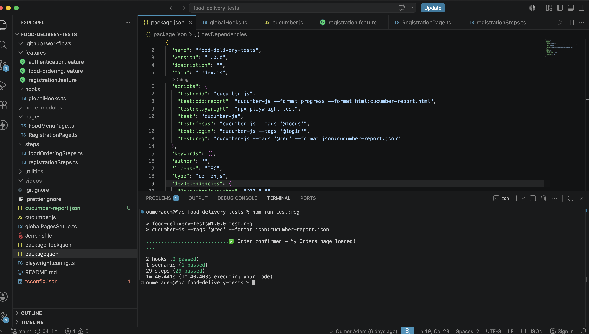

# 🍅 Tomato Food Delivery — E2E Test Automation Framework

> Production-grade BDD automation framework validating the complete user journey of a full-stack MERN food delivery app — from registration through Stripe payment confirmation.

[](https://www.typescriptlang.org)
[](https://playwright.dev)
[](https://cucumber.io)
[](https://nodejs.org)
[](https://fakerjs.dev)

---

## 🔗 Links

| | |
|---|---|
| 🌐 Live App | https://tomato-food-delivery-zeta.vercel.app |
| 💻 App Repo | https://github.com/Oumeradem/food-del |
| 🧪 Test Repo | https://github.com/Oumeradem/food-delivery-tests |

---

## ✅ 29 Steps — 1 Scenario — Full User Journey

Registration → Login → Add to Cart → Checkout → Stripe Payment → Order Confirmed

**29/29 steps passing in ~1m 17s**

---


## 🎬 Demo Video
[▶️ Watch Full E2E Test Run (Playwright + Cucumber)](https://youtu.be/S0vs8daK1rw)

## ✅ 29 Steps — 1 Scenario — Full User Journey
Registration → Login → Add to Cart → Checkout → Stripe Payment → Order Confirmed

**29/29 steps passing in ~1m 17s**

## 📸 Test Results

### ✅ All 29 Steps Passing



## 🎯 What This Framework Demonstrates

- **BDD Methodology** — Human-readable Gherkin scenarios bridging business requirements and automated tests
- **Page Object Model** — Scalable architecture separating locators from test logic
- **Real-world Payment Testing** — Automated Stripe checkout including iframe handling
- **Human-like Interaction** — `pressSequentially()` with 20ms delay triggers all browser events
- **Data-driven Testing** — Faker.js generates unique test data on every run
- **Cross-step State Management** — Cucumber World context shares credentials across all steps

---

## 📋 Key Technical Challenges Solved

| Challenge | Solution |
|-----------|----------|
| Stripe card fields inside nested iframes | Iterated all page frames to locate and fill card fields reliably |
| Stripe Link popup blocking card form | Used `evaluate()` to uncheck "Save my info" via JavaScript |
| Card accordion not expanding via standard click | Used `aria-label` JavaScript button targeting to open card panel |
| State/country mismatch in delivery form | Paired `faker.location.state()` with hardcoded `'United States'` |
| Vercel 404 on React Router deep links | Added `vercel.json` rewrite rules to serve `index.html` for all paths |

---

## 🏗️ Architecture
food-delivery-tests/
├── features/          # Gherkin BDD scenarios
├── hooks/             # Browser lifecycle setup
├── pages/             # Page Object Model locators
├── steps/             # Step definitions
└── cucumber.js        # Framework configuration

---

## 🚀 Quick Start

```bash
git clone https://github.com/Oumeradem/food-delivery-tests.git
cd food-delivery-tests
npm install
npx playwright install
npm run test:reg
```

---

## 👤 Oumer Adem
*Aspiring Software Engineer | QA Automation | Full-Stack Development*

[](https://www.linkedin.com/in/oumer-adem)
[](https://github.com/Oumeradem)
[](mailto:oumer.adamye@gmail.com)
